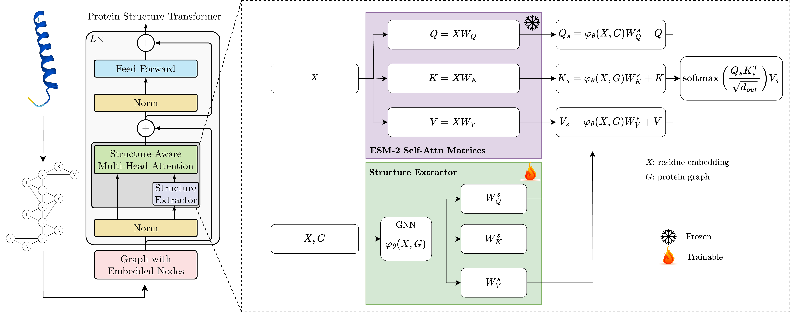

# Protein Structure Transformer

The repository implements the Protein Structure Transformer (PST). The PST performs a simple modification to the attention mechanism of a sequence-based protein-language model to add structural information. The PST is described in the paper [Protein Structure Transformer][1].


**TL;DR**: 

## Citation

Please use the following to cite our work:

```bibtex
```


## A short description of PST

### Overview of PST

PST uses a structure extractor to incorporate protein structures into existing protein language models (PLMs) such as [ESM-2](https://github.com/facebookresearch/esm/tree/main).
The structure extractor adopts a GNN to extract subgraph representations of the 8Å-neighborhood protein structure graph at each residue (i.e., nodes on the graph). The resulting residue-level subgraph representations are then add to the $Q$, $K$ and $V$ matrices of **each** self-attention block of any (pretrained) transformer model (here we use **ESM-2**) pretrained on larger corpuses of sequences. We name the resulting model PST, which can be trained on any protein structure dataset, by either updating the full model weights or only the weights in the structure extractor. The pretraining dataset could be much smaller than the pretraining dataset of the base sequence model, e.g., SwissProt with only 550k protein structures. 

### Example of PST with SAT with ESM-2 as backbone

Below you can see a typical setup of PST with the [SAT][3]-based structure extractor and ESM-2 as a backbone. The ESM-2 model weights are frozen during the training of the structure extractor. The structure extractor is trained on a small dataset of 350K proteins with predicted structure. The resulting PST model can then be finetuned on a downstream task, e.g. [torchdrug][5] or [proteinshake][4] tasks. However, as we show in the paper, such a finetuning is not necessary to achieve state-of-the-art results on many tasks.



### Run inference using PST

To see how you can get better representations from your data using PST, see `./scripts/pst_inference.py` for more details.

### Pretrained models

| Model name | #Layers | Embed dim | Train struct only | Model URL |
|:-----------|:-------:|:---------:|:-----------------:|:---------:|
| pst_t6     |    6    |    320    |       False       |   link    |
| pst_t6_so  |    6    |    320    |       True        |   link    |

### Pretrain PST on AlphaFold Swissprot

Run the following code to train a PST model based on the 6-layer ESM-2 model by only training the structure extractor:

```bash
python train_pst.py base_model=esm2_t6 model.train_struct_only=true
```

You can replace `esm2_t6` with `esm2_t12`, `esm2_t30`, `esm2_t33` or any pretrained ESM-2 model.

## Installation

The dependencies are managed by [mamba][2]

```

mamba create -n pst python=3.9 pytorch torchvision torchaudio pytorch-cuda=12.1 pyg lightning nvitop pytorch-scatter -c pytorch -c nvidia -c pyg
mamba activate pst
pip install proteinshake isort black fair-esm pyprojroot einops torch_geometric==2.3.1 pandas easydict pyprojroot scikit-learn flaml

```

Once you have activated the environment and installed all dependencies, run:

```bash
source s
```


[1]: https://arxiv.org/abs/TODO
[2]: https://mamba.readthedocs.io/en/latest/installation/mamba-installation.html
[3]: https://arxiv.org/abs/2202.03036
[4]: https://proteinshake.ai/
[5]: https://torchdrug.ai/ 